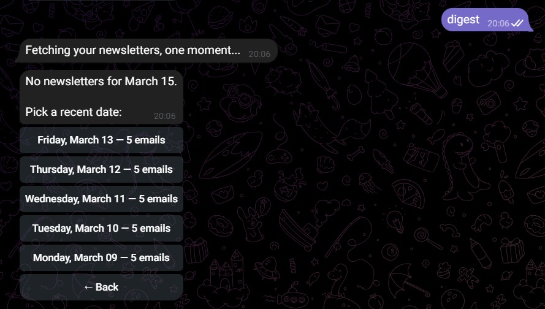
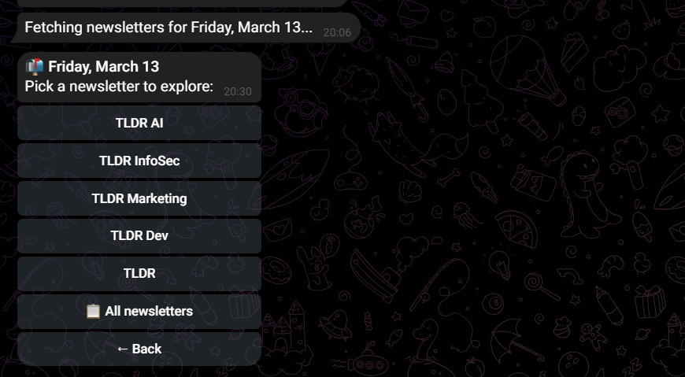
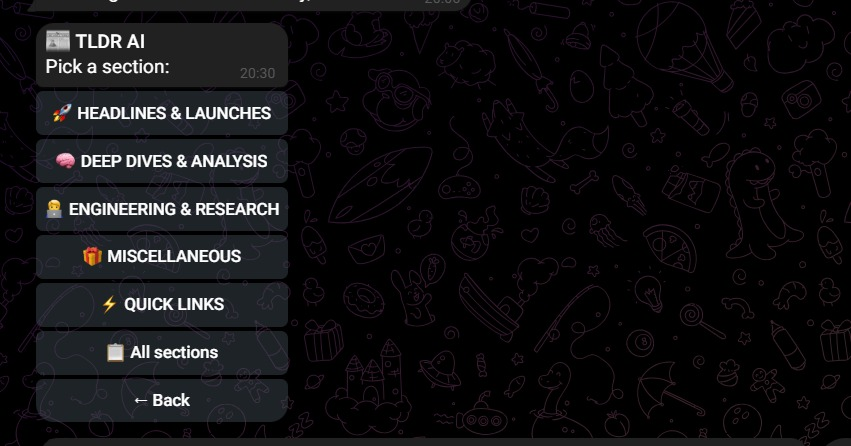
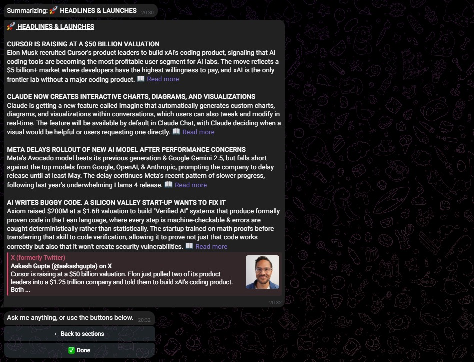
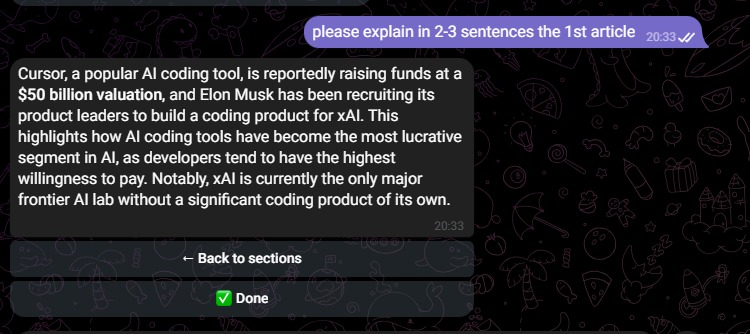
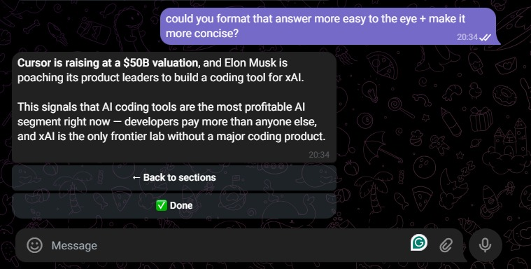

# Daily Digest 📬


> *Your newsletters, summarized. Your questions, answered.*

A personal Telegram bot that fetches Gmail newsletters, summarizes them with Claude AI, and lets you have a real conversation about what you read — all from your phone, in under a minute.

Built for people who subscribe to a lot of newsletters and want to stay informed without spending 45 minutes reading.

---

## The problem

You subscribe to newsletters because you want to stay informed. But they pile up. You skim, you skip, you forget. By the time you sit down to read, there are five of them waiting — and you don't have an hour.

Daily Digest fixes that. One message, and you're caught up.

---

## How it works

**Type "digest" → pick a date**



**Choose a newsletter**



**Browse sections**



**Get a sharp AI summary — with article titles, context, and links**



**Ask anything — Claude has the full context of what you just read**



**Iterate — reformat, simplify, go deeper**



---

## Stack

| Component | Tool |
|---|---|
| Email | Gmail API |
| Bot | python-telegram-bot |
| Summarization | Claude Haiku |
| Conversation | Claude Sonnet |
| State | SQLite |
| Scheduler | APScheduler |
| Hosting | Railway |

---

## Architecture

```
Gmail API
    │
    ▼
Email Parser          ← reconstructs sections, articles, and URLs
    │                    from plain-text newsletter format
    ▼
Claude Haiku          ← summarizes each section into
    │                    titled bullets with read-more links
    ▼
SQLite Cache          ← summaries stored per session,
    │                    no re-summarization on repeat views
    ▼
Telegram Bot          ← inline keyboard navigation
    │                    date → newsletter → section → summary
    ▼
Claude Sonnet         ← conversational follow-up,
                         full section context injected into prompt
```

---

## What made this interesting to build

**The email parser**
TLDR newsletters arrive as Gmail plain text — no HTML, no clean structure. Links use a reference-style format (`[1] https://...` at the footer). Titles get word-wrapped at 70 characters. Sections are delimited by emoji patterns. Building a parser that handles all of this reliably across 5 different newsletter variants was the core challenge.

**Knowing when not to parse**
Some sections (like GitHub repos) don't have article structure at all. The summarizer detects this and falls back to summarizing the raw text directly — rather than returning an empty result.

**Context-aware conversation**
Follow-up questions aren't just sent to Claude cold. The full section summary is injected as context alongside the conversation history, so Claude always knows exactly what you're asking about — without you having to re-explain.

**Stateless secrets**
Gmail OAuth credentials live as base64-encoded environment variables in Railway. A startup script decodes and writes them to disk before the bot boots. No secrets in the repo, no manual file transfers, clean redeploys.

---

## Why I built this

I subscribe to 5 TLDR newsletters — AI, InfoSec, Marketing, Dev, and the main one. Reading all of them was taking too long, and most summary tools either miss structure, hallucinate links, or don't let you ask follow-up questions. I wanted something that fits how I actually read: quick scan, then go deep on whatever catches my eye.
